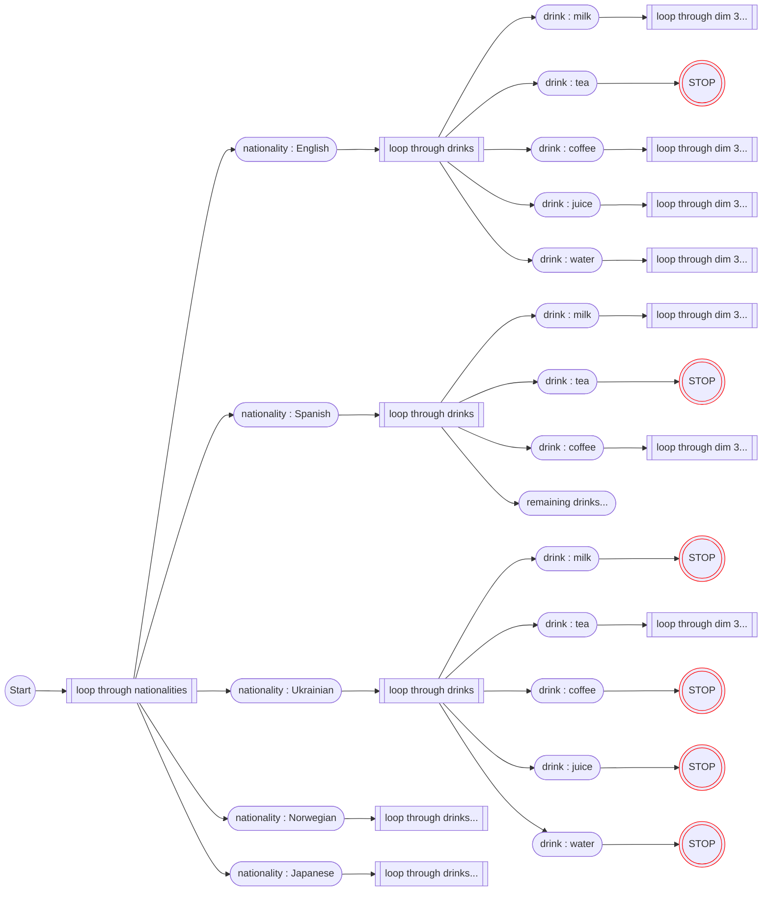

# Applying Knuth's X Algorithm to solving Zebra Puzzles (a.k.a. Einstein's Puzzle)

This document explains my approach and work on the latter problem - the Zebra Puzzles.

## Abstract

...

## 1. Prerequisites

A prerequsite to follow my explanation of how I used the X algorithm to solve Zebra Puzzles, is to understand the concepts refered to in this section. This section serves only as a reminder, not a full course or explanation of each of the concepts.

### 1.1. Constrain satisfaction and set coverage problems

A [Constraint Satisfaction Problem](https://en.wikipedia.org/wiki/Constraint_satisfaction_problem)(CSP) is a "mathematical question defined as a set of objects whose state must satisfy a number of constraints or limitations."[^1]

Many logical puzzles can be modeled as a CSP[^1], including but not limited to Sudoku and Einstein's Riddle.

A [Set Cover problem](https://en.wikipedia.org/wiki/Set_cover_problem) can be worded as :
Given a set *U*  (the universe), and a collection ***S*** of a given ***m*** subsets of ***U*** whose union equals the universe, the set cover problem is to identify a smallest sub-collection of ***S*** whose union equals the universe.

In other words, given a set ***U*** (the universe) and a set ***S*** (the collection) such that:

$$
\left\\{
\begin{array}{l}
S = \\{x : x \in U \\}\\
\bigcup S = U\end{array}
\right.
$$

Find a sub-collection $`S^*`$ - the smallest subset of the collection, such that $`\bigcup S^* = U`$.

A more sctrict formulation is the [Exact Cover](https://en.wikipedia.org/wiki/Exact_cover) problem, which additionally requires that all elememts of $S^*$ are pairwise disjoint.

One of the ways to represent some of the CSPs is encoding them as a n Exact Cover problem[^2][^3]. There are known methods to solve set cover problems, for example Knuth's X algorithm. Therefore if we are able to map a puzzle or a riddle to n exact cover problem, we can solve such a puzzle.

### 1.2. Sudoku as an example of a set coverage problem

Sudoku can be modelled as an exact cover problem[^4] as follows:
- **elements** the Universe $U$ are representing specific **constraints** of the sudoku puzzle, such as:
  - "there is a `1` in the first row"
  - "there is a `2` in the first row"
  - "there is a `3` in the first row"
  - ...
  - "there is a `9` in the first row"
  - "there is a `1` in the second row"
  - ...
  - "there is a `8` in the ninth row"
  - "there is a `9` in the ninth row"
  - "there is a `1` in the first column"
  - ...
  - "there is a `9` in the ninth column"
  - "there is a `1` in the first 3x3 box"
  - ...
  - "there is a `9` in the ninth 3x3 box"
  - "the grid position (1,1) has a number in it
  - "the grid position (1,2) has a number in it
  - ...
  - "the grid position (9,9) has a number in it
- each **possibility** of putting a number in any of the grid positions represetns a fulfillment of **several of the constraints** - i.e. it is a subset of $U$. For example:
  - putting the digit '5' in grid position (2,3) fulfills the following constraints:
    - "there is a `5` in the second row"
    - "there is a `5` in the third column"
    - "there is a `5` in the fist 3x3 box"
    - "the grid position (2, 3) has a number in it
  - putting the digit '7' in grid position (4,5) fulfills the following constraints:
    - "there is a `7` in the fourth row"
    - "there is a `7` in the fifth column"
    - "there is a `8` in the fourth 3x3 box"
    - "the grid position (4,5) has a number in it
    - etc.
- each constraint must be fulfilled **exactly once** (if there is a `5` in row *x*, there is exactly **one** `5` in row *x*, etc.)
  
### 1.3. Knuth's X Algorithm using a sparse matrix

"Algorithm X is an algorithm for solving the exact cover problem. It is a straightforward recursive, nondeterministic, depth-first, backtracking algorithm used by Donald Knuth to demonstrate an efficient implementation called DLX, which uses the dancing links technique."[^5]

To do it it works on a sparse matrix that is an incidence matrix of which solution elements satisfy which constraints. THat is in the matrix:
- columns represent the constraints / elements of the ***U*** universe
- rows represent available options / elements of the ***S*** collection of subsets of ***U***
- matrix is filled with `0`` by default except for...
- if a given option/member of ***S*** (row) fulfills/contains a given constraint/element of ***U*** (column), a `1` is put instead

Applying Knuth's X algorithm to thesparse matrix solves the CSP it represtents. What we need though is to properly represent the solution elements and the constraints in the matrix.

### 1.4 What is a "Zebra Puzzle"?

The "Zebra Puzzle", alo known as "the Einstein Riddle" is a logic puzzle known in many vartations, most notably in the following (attributed to Einstein, hence the alternative name)[^6]

> There are five houses.
> - The Englishman lives in the red house.
> - The Spaniard owns the dog.
> - Coffee is drunk in the green house.
> - The Ukrainian drinks tea.
> - The green house is immediately to the right of the ivory house.
> - The Old Gold smoker owns snails.
> - Kools are smoked in the yellow house.
> - Milk is drunk in the middle house.
> - The Norwegian lives in the first house.
> - The man who smokes Chesterfields lives in the house next to the man with the fox.
> - Kools are smoked in the house next to the house where the horse is kept.
> - The Lucky Strike smoker drinks orange juice.
> - The Japanese smokes Parliaments.
> - The Norwegian lives next to the blue house.
>
> Now, who drinks water? Who owns the zebra? 
> In the interest of clarity, it must be added that each of the five houses is painted a different color, and their inhabitants are of different national extractions, own different pets, drink different beverages and smoke different brands of American cigarets. One other thing: in statement 6, right means your right. 

## 2. How to model the Zebra Puzzle as a Set Coverage Problem

In parallel to Sudoku, to model the Zebra Puzzle as a sparse matrix for an Exact Cover problem, we need to decide:
- what are the elements of our Universe ***U***
- what constraints does the puzzle pose, and how to map them to subsets of ***U***

First we can observe that within the riddle text there is mentions of a number people living in the same number of houses. Each person has a set of attributes. For each person the attriburtes are along the same set of "dimensions" (e.g. each person has a "nationality", each person has a "favourite drink"), each with a range of possible values (e.g. for nationality it's: Norwegian, British, German, Swedish etc.). And no two persons share the same value along a common dimension - that is: there is one and only one person who's Norwegian, there is one and only one person who drionks milk, etc. Whaat follows from all the "one and only one" constraints, is that each person in the final solution needs to have a full set of attributes (Nationality, drink, pet, brand of sigarretes etc.) and a house number where they live.

Commonly[^7][^8][^9] this is then visualised as a grid (*not* yet the Knuth's sparse matrix) that has palces for each house and each *attribute dimension* where *attribute values* are placed, fulfilling the constraints.

**available attributes**
* Nationality : Norwegian
* ~~Nationality : British~~
* Nationality : German
* Nationality : Dutch
* Nationality : Swedish
* Drink : Milk
* ~~Drink : Water~~
* ...

**Partial solution**
| |house #1|house #2|house #3|house #4|house #5|
|-|---|---|---|---|---|
|Nationality|?|?|British|?|?|
|Drink|?|Water|?|?|?|
|Cigarette|?|?|?|?|?|
|Pet|?|?|?|?|?|
|Color|?|?|?|?|?|

Apart from the "trivial" constraints of the "one and only one" type, we can identify further constraint types in the riddle, as follows:
* **"identity" constraints** - any statement that forces a person living in a house to have two attributes coinciding, not necessarily naming the exact hosue number. These are statements in the form "*The person whose `dimension_a` has value `value_a` also has `value_b` in `dimension_b`*", For example:
  > "*The Spaniard owns the dog*"

  `dimension_a` = "nationality",\
  `value_a` = "Spanish",\
  `dimension_b` = "pet",\
  `value_b` = "dog"
* **"directed neighbor constraints"** - any statement that forces two people living next to each other to have their attributes coinciding, not  naming the exact hosue number. These are statements in the form "*The person whose `dimension_a` has value `value_a` lives on the `direction` of the person whose `dimension_b` has value `value_b`*", For example
  > "*The green house is immediately to the right of the ivory house.*"

  `dimension_a` = "color",\
  `value_a` = "green",\
  `dimension_b` = "color",\
  `value_b` = "ivory",\
  `direction` = "right"
* **"non-directional neighbor constraints"** - similar to directed neighbor constraints, with the difference that instead of a specific direction ("left" or "right") the constraint is thatthe two people simply live "next to" each other". For example:
  > "*The Norwegian lives next to the blue house.*"

### 2.1. Obvious naive representation

#### Constraints

Such a visualisation of the problem suggests that:

Elements of *U* could be all possible "one and only one" constraints:
  - attribute uniqueness - each attribute is used only once:
    - there is exactly one person with `nationality` = `Norwegian`
    - there is exactly one person with  `nationality` = `English`
    - there is exactly one person with  `nationality` = `Norwegian`
    - ...
    - there is exactly one person with  `pet` = `cat`
    - ...
  - house completeness and unambiguity - each house has a person with exactly one attribute of each of the avaialble dimensions:
    - the person living in house `1`
      - has exactly one `nationality` value assigned
      - has exactly one `drink` value assigned
      - has exactly one `cigarette` value assigned
      - has exactly one `pet` value assigned
      - has exactly one `house color` value assigned
    - the person living in house `2` 
      - has exactly one `nationality` value
      - ...

Let's call these types of cosntraitns "trivial" - any ZebraPuzzle has to start wit hat least these constraints

For a classical 5x5x5 Zebra puzzle (5 houses, 5 dimensions determine 5 values in each dimension) this gives us $ 5 \cdot 5 + 5 \cdot 5 = 50$ columns fot the "trivial" cosntrints

However, the puzzle has other constrints too, which are not yet represented in the above example.

#### Elements

Elements of ***S*** could simply be paris of attribute and house number. In other a single element would describe a statement like "*The person who's `dimension` has `value` lives in house number `#`*".

* "person with `nationality` = `Norwegian` lives in house `1`"
* "person with `nationality` = `Norwegian` lives in house `2`"
* "person with `nationality` = `Norwegian` lives in house `3`"
* "person with `nationality` = `Norwegian` lives in house `4`"
* "person with `nationality` = `Norwegian` lives in house `5`"
* "person with `nationality` = `British` lives in house `1`"
* ...

For a classical 5x5 Zebra puzzle we have $5 \cdot 5 \cdot 5 = 125$ elements/rows to choose from.

### 2.2 First challenge : "identity" constraints

On the face of it, the rerpesentation proposed above immediately fails to be able to rerpesent the "identity" constraints.
After all, the rerpesetnation is designed mostly towards ensuring each attribute is used only once and, but identity type constraint requires two different attributes to be used. In other word this would be a constraint that is fulfuilled not by "one and exactly one" element of *S* but by two elements.

Let's take for example the statement "*Coffee is drunk in the green house*". Given the proposed ***S***, this "constraint" requires us to choose a pair of elements
* either "*`drink` = `coffee` lives in house `1`*" and "*`house color` = `green` lives in house `1`*"
* or "*`drink` = `coffee` lives in house `2`*" and "*`house color` = `green` lives in house `2`*"
* or "*`drink` = `coffee` lives in house `3`*" and "*`house color` = `green` lives in house `3`*"
* or "*`drink` = `coffee` lives in house `4`*" and "*`house color` = `green` lives in house `4`*"
* or "*`drink` = `coffee` lives in house `5`*" and "*`house color` = `green` lives in house `5`*"

Somehow one constraint requires two elements. This means that either we cannot model the Zebra Puzzle as an exact cover problem, or we have to re-engineer how we construct ***S*** and map puzzle text into constraints.

#### Workaround : attribute sets as solution elements

A workaround to the above problem I came up with is to construct the elements of ***S*** not as single attributes placed in slots of the solution grid, but as full columns. That is:

**Naive approach**
element of ***S*** placiong an attribute in the grid. For example:

1. statement: "*person with `pet` = `cow` lives in house `4`*"

2. grid fill-in:
   | |house #1|house #2|house #3|house #4|house #5|
   |-|---|---|---|---|---|
   |Nationality|-|-|-|-|-|
   |Drink|-|-|-|-|-|
   |Cigarette|-|-|-|-|-|
   |Pet|-|-|-|**cow**|-|
   |Color|-|-|-|-|-|

**Columnar approach**
Element of ***S*** is filling in an entire column of the grid. For example:

1. statement: "*Person living in house `4` is of `Dutch` nationality, drinks `Whiskey`, smokes a `pipe`, has a pet `cow` and their hosuoe is painted `orange`"

2. grid fill-in:
   | |house #1|house #2|house #3|house #4|house #5|
   |-|---|---|---|---|---|
   |Nationality|-|-|-|Dutch|-|
   |Drink|-|-|-|Whiskey|-|
   |Cigarette|-|-|-|pipe|-|
   |Pet|-|-|-|cow|-|
   |Color|-|-|-|orange|-|

Upside of this approach is that all "identity" constraints are represented by simply selecting one of the allowed combinations. This generally is feasible using the X algorithm.

The downside is that we have now many more elements of ***S***. In the niave approach we needed only as many elements in ***S*** as there were possible attribute values. In the classic puzzle with 5 dimensions (nationality, drink, cigarette, pet, house color), 5 possible values for each dimension and five houses to populate, gave us $|S| = 5 \cdot 5 \cdot 5 = 125$. With the "columnar" approach we have as many elements as there are *combinations* of attributes, and each combination can be assigned to any of the houses, which gives us $|S| = 5 ^5 \cdot 5 = 15 625$

I will discuss later on how we can reduce that number when generating the sparse matrix. Also, during the work on implementing this approach I relised that the "naive" approach can be adapted wo work, giving us the benefit of a small ***S*** while still modelling all cosntraitns properly. That notion will be expanded upon in a separate project. However, for now, unless otherwise noted, all further work on my solution to the puzzle will be based on using the "columnar" approach.

At the same time, since we cosntructed the elements of ***S*** in this "columnar" approach such that one column already has exactly one attributefro meach of the avaialble dimensions, the "trivial" constraints can ignore the """house completness and unambiguity" cosntraints, leaving us with only **25** "trivial" columns

### 2.3 Second challenge : directed neighbor constraints

Now let's turn our attention to the next, as of yet unhandled, type of cosntraitn - the directed neighbor constraint. I chose to describe this one beforethe non-directional subtype, because it is the next one I was able to figure out how to represent in the sparse matrix. Even though it is used only once in the original puzzle text.

The challenge, again, is that we are requiring a coincidence of two attributes. But instead of both of them being for the same person (living in one house), we require the coincidence to happen for two separate people living in neighboring houses. Using the approach form the first workaround would make the number of elements in ***S*** explode exponentially. After all, now we'd have to list all the combinations of all possible neighbors. This is not practical by any means.

My intuition told me that we can treat these like a key-lock pair. After all selecting the attribute placement of one of the neighbors defined by the constraint directly dictates where to place the other attribute. For example, if we consider the following constraint: 

> "*The green house is immediately to the right of the ivory house*" 

We can see that we have the following options:
* `green` is house number `2` (regardless of its values along other dimensions), and `white` is house number `1` (regardless of its values along other dimensions)
* `green` is house number `3` and `white` is house number `2`
* `green` is house number `4` and `white` is house number `3`
* `green` is house number `5` and `white` is house number `4`

we basically have four ways of satisfying the constraint. And the chosen elements of ***S**** are complimentary. Choosing where to put the "green" house directly implies where the "iovry" one has to be.

#### Solution : additional matrix columns

Intuitively by playing around with the concept of key-lock image of the constraints, as well as noting that the complimentary nature of the selected items can be understood that selecting one element both implies selecting another **and** ***not*** selecting several others, I came to and abstract representation of the neighbor constraint that follows.

For ease of notation let's use the following notation:
1. if we denote an attribute (dimension and its value) as **A** then **$S_A$** denotes all elements from ***S*** that have that attribute. For example if **A** = "*drink is milk*" then **$S_A$** = set of all elements of ***S*** where `drink` = `coffee`, regardless of the values in other dimensions
2. Furthermore **$S_{!A}$** denotes all elements from ***S*** that **do not** have the attribute **A**.  In the above example, these would be all elements where `drink` is **anything but coffee** (milk, water, etc.) regardless of the values in other dimensions.
3. A special type of attribute is the house number. we denote it as ***Ni*** (*i* being a number). For example ***N2*** denotes "*a person living in house number `2`*"
4. we denote the intersection of any **$S_A$** and **$S_A$** as  **$S_{[A,B]}$**. In other words $S_{[A,B]}=S_{[B,A]}=S_A \cap S_B$

**Proposal**

My proposition is that we can represent the puzzle constraint expressed in natural language as "*Person with attribute `A` lives left/right of person with attribute `B`*" as a *set* of columns - each corresponding to one of the possible neighbor arrangements in space.

Following our example 

> "*The green house is immediately to the right of the ivory house*" 

we assign the attributes as:

* A = "`house color` is `green`"
* B = "`house color` is `ivory`"

(NOTE: in this case both A and B shhre the same dimension, but that does not need to be the case always)

Given our notation and assignments, for example $S_{A,!B,N4}$ menas "*all elements of **S** where `house color` is `green` and `house` color is not `ivory` and house number is `4`*" (all the while pet, cigarette, nationality and drink are of anny avaiallbe value).

Then the constraint can be represented in the sparse matrix as a collection of atomic constraint columns implementing the key-lock approach as follows:
* we have an additional atomic constraint column representing each of the options of placing the first neighbor.
* elements of $S_{A,!B,Ni}$ have cells filled in constraint columns for option *i* (the key)
* elements of $S_{!A,B,Ni}$ have cells filled in constraint columns for all options but *i* (the complementary lock)
* any remaining other elements are not matched

||option 1|option 2|option 3|option 4|
|-|:-:|:-:|:-:|:-:|
|$S_{A,!B,N2}$|⬤|◯|◯|◯|
|$S_{A,!B,N3}$|◯|⬤|◯|◯|
|$S_{A,!B,N4}$|◯|◯|⬤|◯|
|$S_{A,!B,N5}$|◯|◯|◯|⬤|
||||||
|$S_{!A,B,N1}$|◯|⬤|⬤|⬤|
|$S_{!A,B,N2}$|⬤|◯|⬤|⬤|
|$S_{!A,B,N3}$|⬤|⬤|◯|⬤|
|$S_{!A,B,N4}$|⬤|⬤|⬤|◯|
||||||
|other*|◯|◯|◯|◯|

*) *any elements not listed explicitly above, i.e. $`S_{!A,!B}`$ and $`S_{A,B}`$ (if they exist)*

**Comparison to natural language**

Each of the "options" is hard to represent in natural language. Especially that only in ocncert do they express the more "natural" concept of "*`A` is left/right of `B`*". Nevertheless they could be translated into something like:
* option 1 = "second house is green OR the ivory house is in not in position 1"
* option 2 = "third house is green OR the ivory house is in not in position 2"
* option 3 = "fourth house is OR the ivory house is in not in position 3"
* option 4 = "fifth house is OR the ivory house is in not in position 4"

**Completeness**

Note how:
* We have sets of complimentary attributes (A,!B) and (!A,B) fullfill the new atomic constraints, but not (A,B) - this is because the two people are neighbors, not the same person, so one having one of the attributes exlcude that person from having the other attribute mentioned in the constraint.
* House indexes for the complimentary attributes ("house color is green" written as $S_{A,!B,Ni}$ where i = 2...5) are shifted by one to the right compared to the indexes for the other attribute ("house color is ivory" written as $S_{!A,B,Ni}$ where i = 1...4) - thisis because the neighbors' relative positions are exactly defined.
* It is impossible to complete all four options jsut by selecting one of eahc of the $S_{A,!B,Ni}$ elements, because choosing any one of them precludes choosing any other ofthem, because of the "trivial" constraints mentioned earlier.
* for example choosing any of $S_{A,!B,N2}$ ("*second hosue is green*") makes choosing any of $S_{A,!B,N3}$ through $S_{A,!B,N5}$ impossible, because no other hosue can be green anymore in this situation.
* The representation is complete. The only way to cover all of the options (matrix columns representing atomic constraints) that constitute the puzzle text (puzzle constraint) we need to pick exactly one of the !A,B items and one of the A,!B items, so that their indexes are in the correct order (one is right of the other). 

**Selection of solution by de-selecting non-solutions**

Note that for the  `!A,B` elements, combining several "*is not in position x*" statements effectively determines the actual position of the other person unambiguously by process of elimination. If we select all possible positions minus the one already occupied by `A,!B`, minus all the ones excluded by the atomic constraints, we are left us always with but one option

**Omitting invalid assignments**

Also note that we skip invalid indexes when filling in the sparse matrix. This is specifically to  avoid an edge case, where after applying the index shifting, one element of ***S*** covers all options. Specifically in our example any member of $S_{!A,B,N5}$ would fulfill all four options. If we cosntruct this case by extension from the already mentioned ones we get:

$S_{!A,B,N5}$ = "`ivory` is the color of the house number `5`"

||option 1|option 2|option 3|option 4|
|-|:-:|:-:|:-:|:-:|
|$S_{!A,B,N5}$|⬤|⬤|⬤|⬤|

### 2.4. Third challenge : non-directed neighbor constraints

Finally the non-directed neighbors constraints. Initially they look similar to the previous ones. Albeit with onekey difference: selecting one of the neighbors does not unambiguously let us determine the other neighboring attribute. Let's consider the following example:

> "*The Norwegian lives next to the blue house*"

we assign the attributes as:

* A = "`nationality` is `Norwegian`"
* B = "`house color` is `blue`"

This time we can see that selecting where to place the first attribute sometimes leaves us with two possible placements for the second one:
* `Norwegian` is in house number `1` (regardless of its values along other dimensions), and `blue` is house number `2` (regardless of its values along other dimensions), BUT
* `Norwegian` is in house number `2` and
   - either `blue` is house number `1`
   - or `blue` is house number `3`
* `Norwegian` is in house number `3` and
   - either `blue` is house number `2`
   - or `blue` is house number `4`
* `Norwegian` is in house number `4` and
   - either `blue` is house number `3`
   - or `blue` is house number `2`
* `Norwegian` is in house number `5` and `blue` is house number `4`

We need to be able to somehow select one of the options and then (if needed) its "sub-option". 

#### Solution : even mode additional matrix columns and rows

Note: all sub-options can be grouped pairwise and rearranged on the above list. Like that:
* the two neightobrs in question live in houses `1` and `2`
  * either `Norwegian` lives **left** (1) and `blue` is **right** (2)
  * or `Norwegian` lives **right** (2) and `blue` is **left** (1)
* the two neightobrs in question live in houses `2` and `3`
  * either `Norwegian` lives **left** (2) and `blue` is **right** (3)
  * or `Norwegian` lives **right** (3) and `blue` is **left** (2)
* ...

**Proposal**

Building on the previously proposed key-lock arrangement of the sparse matrix I propose a solution in which we are able to select one of the new super-options by adding new synthetic rows to the matrix. Each of those rows would represent placing the two neightbors in a given place overall. Or rather: key in our possible selection of exact neighbors. Then selection of the actual attribute placement would follow by complimenting that pre-selection.

* we have an additional atomic constraint column representing each of the options of placing any of the two neighbors.
* we have additional elements in ***S*** representing the possible arrangements of the pair of neighbors in adjacent positiosn *i* and *i+1*. Each such element has them atrix filled in for columns representing options i* and *i+1* (the lock)
* elements of $S_{A,!B,Ni}$ have cells filled in constraint columns for option *i* (first part of the key)
* elements of $S_{!A,B,Ni}$ have cells filled in constraint columns for option *i* (second part of the key)
* any remaining other elements are not matched

To visualise the above in the sparse matrix:

||option 1|option 2|option 3|option 4|option 5|
|-|:-:|:-:|:-:|:-:|:-:|
|one neighbor is from $S_{N1}$   and the other from $S_{N2}$|◯|◯|⬤|⬤|⬤|
|$S_{N2}$ and $S_{N3}$|⬤|◯|◯|⬤|⬤|
|$S_{N3}$ and $S_{N4}$|⬤|⬤|◯|◯|⬤|
|$S_{N4}$ and $S_{N5}$|⬤|⬤|⬤|◯|◯|
|||||||
|$S_{A,!B,N1}$|⬤|◯|◯|◯|◯|
|$S_{A,!B,N2}$|◯|⬤|◯|◯|◯|
|$S_{A,!B,N3}$|◯|◯|⬤|◯|◯|
|$S_{A,!B,N4}$|◯|◯|◯|⬤|◯|
|$S_{A,!B,N5}$|◯|◯|◯|◯|⬤|
|||||||
|$S_{!A,B,N1}$|⬤|◯|◯|◯|◯|
|$S_{!A,B,N2}$|◯|⬤|◯|◯|◯|
|$S_{!A,B,N3}$|◯|◯|⬤|◯|◯|
|$S_{!A,B,N4}$|◯|◯|◯|⬤|◯|
|$S_{!A,B,N5}$|◯|◯|◯|◯|⬤|
|||||||
|other|◯|◯|◯|◯|◯|

**Completeness**

Similarily to above points about directed neighbors:
* no two rows from the $S_{!A,B,Ni}$ group can be chosen due to "trivial" constraints
* no two rows from the $S_{A,!B,Ni}$ group can be chosen due to "trivial" constraints
* to cover all options (atomic constraints) we need to select exactly three rows:
  1. one of the "*neighbors are in $S_{Ni}$ and $S_{Nj}$*" elements - the keying element,
  2. one of the items to be the first neighbor - in whichever of the two possible places,
  3. another item to be the other neighbor - occupying the remainig place.

**Other notes**

As with the directed neighbors, so here we describe the solution to be selecteed by uisng complimentary key-lock entires in the matrix, and somehow de-selectign the elemnents undesired in the solution.

This representation is even harder to translate back int onatural language, but by now hopefully you can see how the puzzle constraints expressed in natural language can be modelled by more elaborate combinations of rows and columns in the sparse matrix, all the while preserving the constraint's "logic".

As with the directed neighbors, care needs to be taken to omit invalid combinations of house indexes when cosntructing the synthetic rows and atomic constraint columns.

## 3. Implementation considerations

After defining the problem and how to model as an Exact Cover problem and how it can be represented in the X algorithm's sparse matrix, we need to consider a few practical details of how to actually implement it in code. First and foremost:
- how to effectively create the rows representing elements of ***S***
- how to effectively creeate the columsn representingthe constraints
- how to match the rows agains the appropriate columns (or vice versa)

### 3.1. Number of combinations and "row culling"

As mentioned in 2.2, if we switch from a "naive" representation (***S*** elements are tiles on the solution "grid") to a "columnar" representation (***S*** elements are full columns of the solution grid) we increase the collection cardinality dramatically. For the classic 5x5x5 puzzle it goes from 125 to ~15k. This is because we have to generate all possible combinations of all the dimension values.

However, we can dramatically reduce that number already when generatign the ***S*** rows. Consider this:
- to generate all combinations of all possible values in each dimension we could simply execute a nested loop through each dimension in sequence:
  1. looop through all values of dimension 1. While doing that, in each itermation...
  2. looop through all values of dimension 2. While doing that, in each itermation...
  3. looop through all values of dimension 3. While doing that, in each itermation...
  4. ...
- a column is build by combining, on the lowest level of the loop, all valeus for meach of the dimension

BUT

While looping, we can check whether or not any of the partial attribute sets are invalid and skip step(s) in the loop if needed.  Let's consider those nested loops as a depth-first search of a tree of all possible combinations of dimension values. For the sake of an example let's assume:
- we are at the beginning of the nesting
- first dimension is `nationality`
- second dimension is `drink`
And let's consider how the constraint "*The Ukrainian drinks tea*" would affect loop execution.

Given that constraint we know that: 
- any element where `nationality` = `Ukranian` cannot have a `drink` other than `tea`
- and conversly any element where `drink` =`tea` cannot have `nationality` be `Ukranian`

Thislet's us skip loop steps whenever we detect any invalid comnbination:

In the tested example such an approach of "culling" invalid elementary elements resutled in reducing the size od ***S*** by two orders of magnitude to around 300 entries. 

### 3.2. Lookup and filling in the sparse matrix

As mentioned in 2.2 and 2.3 to properly represent the two different types of neighbor constraints, we alo need to cosntruct several addtional constraint columns. For a puzzle with *n* houses weneed *n-1* additional columns for each directed neighbor constraint and *n* for each undirected neighbor constraint. We also need *n* additional "keying" rows for each undirected neighbor constraint.

Having created all the rows and all the columns we ned to fill in the matrix. To facilitate the process we want to avoid a situation in which each of the created rows is compared agains each of the created columsn and see if they should be connected. So, for easier lookup of which rows should be connected to which columns, I constructed a lookup mechanism:
- on one hand all rows have their defining attributes assigned to them
  - for "trivial" rows it simply all five attributes of each row
  - for all extra rows for undirected neighbors it's the two attributes (one for each neigbor) and the position in which the pair could be placed
- on the opther hand, when creating columns, they are indexed in dictionaries matching their characteristic
  - for each "trivial" column it's the column's respective attribute and house position
  - for the addtional neighbor columsn it's the attributes of each neighbor pairing and the position they relate to

Because of how the matrix is filled in, even with these lookup dictionaries for columns it still resutls in quite many loops. Consider an example of assigning the "triviasl" elemetns of ***S*** to the directed neighbor columns:

1. We have a classical 5x5x5 puzzle
2. We have a neighbor cosntraint in the form "*Person with attribute `A` lives left of the person with attribute `B`*"
2. we need extra 4 columns for the key-lock representation, as discussed in 2.2
   - these colums can be punt in a dictionary addressed by the two neiughbor attributes and the house number so somewhere in *d[A][B][i]* for *i = 1 .. 4*
3. All rows belonging to %S_{A,!B, Ni} need to be matched to a column with the same i:
   - we look up A in *d*
    - we ***loop*** through all entires *x* in *d[A]* (ineffective loop) and discard ones where *x == B*
       - for each entry *x* we take d[A][x][i]
4. All rows belonging to %S_{!A,B, Ni} need to be matched to a column with the same i:
   - we look up B in *d*
    - we ***loop*** through all entires *x* in *d[B]* (ineffective loop) and discard ones where *x == A*
      - we ***loop*** through all entires *j* in *d[B][x]* (ineffective loop) and discard ones where *j == i*

Given that each "trivial" element of ***S*** hast 5 attributes, we would have to repeat that process $\binom{5}{2} = 10$ times for each element.

## 4. Observations

I have ran the final script against a few different puzzle formualtions:
* [input_1_einstein.yml](input_1_einstein.yml) ("Who's got a Fish?") found in [Polish wikipedia](https://pl.wikipedia.org/wiki/Zagadka_Einsteina#Jedno_z_mo%C5%BCliwych_sformu%C5%82owa%C5%84) (accessed: 2026-01-12, translated by me)
* [input_2_einstein.yml](input_2_einstein.yml) ("Who's got a Zebra?") found in [English wikipedia](https://en.wikipedia.org/wiki/Zebra_Puzzle#Description) (accessed: 2026-03-07)
* [input_3_einstein.yml](input_3_einstein.yml) - ("Ships") riddle found on [brainden.com](http://brainden.com/einsteins-riddles.htm) (accessed: 2026-03-08, **NOTE** site does not support https)

For each of them eventally (with trivial row culling) the program was able to find the correct solution.

### 4.1. Solution times

Infortunately, because of how YML is read, the dimensions, attributes and contraitns are added to the puzzle definition in different order each time the puzzle is ran. So the times presented here are averages of 10 runs for runs wiht trivial row culling, and single runs for runs without row culling. The overall time is so much longer without culling that it was not worth the wait to get precise numbers.

|riddle|avg. backtracks|avg. setup1 time|avg. search2 time|avg. total3 time|
|-|-|-|-|-|
|"fish"|2.10 ± 0.99|111 ± 24|8.2 ± 1.7|154 ± 31|
|"zebra"|2.8 ± 2.0|102 ± 17|8.7 ± 2.2|142 ± 24|
|"ships"|3.70 ± 0.95|102.7 ± 5.2|12.1 ± 2.0|147.0 ± 7.6|

1) time to generate the matrix columns and rows (with culling) and match them \
2) time to find the solution once the matrix is ready \
3) total time from start of program to output of the solution

### 4.2. More advanced puzzles

## 5. Conclusion and next steps

#### Going back to the "naive" approach

[^1]: https://en.wikipedia.org/wiki/Constraint_satisfaction_problem
[^2]: https://en.wikipedia.org/wiki/Set_cover_problem#Related_problems
[^3]: https://en.wikipedia.org/wiki/Exact_cover
[^4]:  https://en.wikipedia.org/wiki/Sudoku_solving_algorithms#Constraint_programming
[^5]: https://en.wikipedia.org/wiki/Knuth%27s_Algorithm_X
[^6]: https://en.wikipedia.org/wiki/Zebra_Puzzle
[^7]: https://www.wikihow.com/Einstein%27s-Riddle
[^8]: https://medium.com/brainzilla/einsteins-riddle-step-by-step-tutorial-on-how-to-solve-the-world-s-hardest-puzzle-46bcf054a7c7
[^9]: https://youtu.be/HaNSHQOrSX8?t=1255
